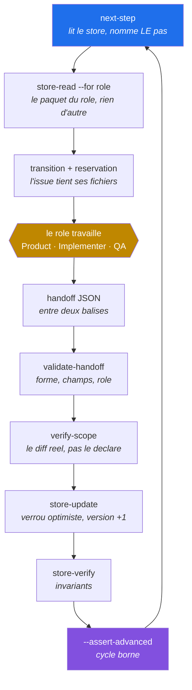
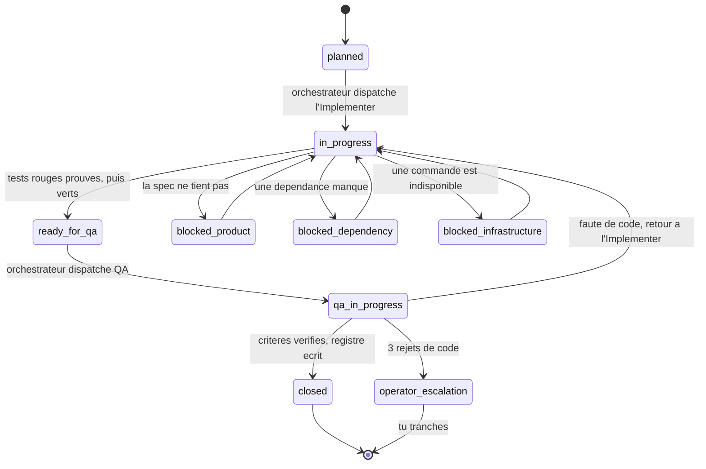
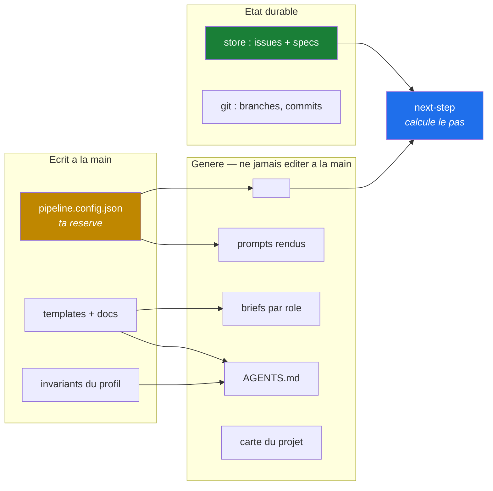

# Operator manual

This document addresses **the human**. Everything else in `agent-pipeline/docs/` speaks to the agents; here we talk about what the machine cannot do for you, and what will not work if you do not do it.

<!-- brief:orchestrator -->
## Answer once, keep the run observable

Three things the operator asked for after a first real run, and each was missing for the same reason: the pipeline had no notion of a session that had already been told what to do.

**The answer is a project fact.** `default_mode` in the configuration says `pipeline` or `direct`. Declared, `CLAUDE.md` renders with the answer instead of the question, and no later session asks again. Absent, the question stands — a project that never chose is a project nobody chose for.

**Do not leave the operator staring at silence.** `next-step` gives one bounded step. When `agent_runtime.command` is configured it also prints an interactive `dispatch.mjs` command: child output is streamed immediately, a heartbeat is emitted every `progress_interval_seconds`, and Ctrl-C is propagated. A heartbeat asks for no response; it only distinguishes work in progress from a dead run.

**Ask when a decision changes the contract or authority.** A scope question, dependency installation, frozen-scope expansion or rejection-budget escalation waits for the operator. Ordinary progress does not. At closure, `render-spec.mjs <out.html> <spec-id>` computes the final report from the store.
<!-- /brief -->

<!-- brief:orchestrator,product,implementer,qa -->
## Work the store never saw

`CLAUDE.md` tells a session to ask, before starting, whether the work goes through the pipeline or straight to the code. Nothing could refuse a session that never asked, and the consequence has been observed twice: a whole feature built directly, `issues.jsonl` at zero lines, and `next-step` answering « no step to run: no open, actionable issue » — which reads as *nothing to do* when the truth was *this pipeline has never seen this repository*.

`unclaimed.mjs` lists the commits touching the declared source roots that no issue claims, and `next-step` says so instead of staying quiet. A commit is claimed when an issue records its sha, or when its subject names an issue the store carries — an issue produces two commits, the red tests then the implementation, and only the last one is recorded.

Direct work stays legitimate: a tooling fix, a question, an exploration. What is refused is direct work the operator never heard about, so such a commit carries a `direct:` line saying why. That keeps it out of the list and puts the reason where a reviewer reads it.

<!-- /brief -->

## What the pipeline is, in one sentence

Four roles pass the work along — Product decomposes, Implementer pins the criteria as red tests then implements, QA verifies, the Orchestrator validates and persists — and durable state lives in a store on disk, not in an agent's memory.

You are not a user of this system: you are a part of it. Three decisions never go to an agent.

## How it works

### One step, and only one

The orchestrator is not a loop holding a feature from start to finish. It is called back **once per transition**, re-reads the state from disk, takes one step, and stops. That is what makes an interruption painless: what matters is already written when it happens.



Two points in this cycle are worth understanding, because they are what distinguishes this pipeline from a chain of prompts.

**`verify-scope` confronts the handoff with the real git diff.** An agent can declare whatever it likes; what gets persisted is what was measured. For a handoff moving to QA, the red proof is **replayed** against the test commit: red must be observed, never declared.

**A single role writes the store.** Product, Implementer and QA read it and never write to it. That is what makes the optimistic lock possible and recovery after an interruption computable.

### The states of an issue



These transitions are not decorative: they live in the `rules_path` file, and a transition absent from that list is refused at write time. **Three code rejections on the same issue lead to escalation, never to a fourth cycle.**

### Where the truth lives



The rule that follows from the diagram: **what is generated is regenerated, never edited.** Three `--check` commands refuse a desynchronised target, and it is the git hooks' job to trigger them.

## The three things that stay with you

**Installing a dependency.** An agent that can add a package can bypass any constraint by importing a library that bypasses it. If a role needs one, it stops and asks you.

**Editing `pipeline.config.json`.** It is the file that defines the gates. An agent that can redefine them can make them green. Single exception: the initial installation in a new project, where the agent writes the configuration because that is the task.

**Merging.** QA validates one issue; it does not guarantee composition between issues, and nobody but you looks at the result of a merge.

## Machine prerequisites

Three prerequisites come from the pipeline itself, whatever the project's stack:

| Prerequisite | Why |
| --- | --- |
| Node | the core scripts are `.mjs` |
| git | the pipeline works by branches and commits |
| Your forge client | Product opens the pull requests |

### What the framework expects of your agent harness

`agent-pipeline/` assumes no agent vendor. Configure `agent_runtime.command` and `agent_runtime.args` as an executable plus an argument list; `{role}` and `{package}` are the only substitutions, and no shell interprets them. The same driver can therefore invoke Codex, Claude Code, Kilo Code or another CLI without changing scheduling, validation or persistence. `prompt_adapter: "portable"` renders plain role prompts; `claude-code` adds Claude's YAML metadata and renders the optional root `CLAUDE.md` entry point.

Run a computed step with:

```
node agent-pipeline/scripts/dispatch.mjs <issue-id> <role>
```

The generated JSON package contains the role, prompt and brief paths, the bounded record view, its hash and state version. The harness receives that package path; it does not need a vendor-specific store integration.

After a human merge, fetch the merge commit and close the durable delivery record:

```
node agent-pipeline/scripts/reconcile-merge.mjs <spec-id> --sha <merge-commit> --merged-at <ISO-date>
```

The command verifies that the SHA exists locally, that the spec reached `pr_open`, and that the store remains valid before and after recording `merged`. A PR merged while its spec still says `pr_open` is drift, not completion.

The rule that follows holds for any output meant for a human: **the framework produces a self-contained file and names what a capable harness should do with it.** The capability belongs to the tool, never to the pipeline. The renderers therefore print, after the path written, the line saying what to do with it — publish if the harness can host, hand over the path otherwise. It is printed where the driver already looks, the command's output, rather than buried in a document it may not have read.

Corollary worth knowing: a harness that cannot publish degrades **nothing** that was guaranteed. The pages open on their own, with no network and no dependency. What is lost is the convenience of a link, not a proof.

The others come from **your** configuration, and that is where the trap is.

Open `commands` in `pipeline.config.json` and note everything not launched by your ecosystem's package manager. Those binaries do not install with the project's dependencies: nobody will bring them for you. **Secret scanning is the most frequent case** — its tool is almost always an external binary.

A missing prerequisite does not show up as an absence, but as a gate that **fails instead of protecting**. And a gate that always fails ends up bypassed or ignored, which is worse than its absence: the repository asserts a protection nobody exercises.

Check them one by one — but not by hand:

```
node agent-pipeline/scripts/preflight.mjs
```

It runs every declared gate and **separates three cases the CI conflates**: green, refusing, or **unrunnable for lack of a tool**. A gate that fails because it found something and a gate that fails because its binary does not exist look alike in a log, and mean entirely different things. Conflated, the second teaches you to ignore the first.

It exits 1 only when a gate is **unrunnable**: a gate that legitimately refuses does not make it fail, that is not its purpose. And it offers only two honest ways out — install the tool, or remove the key from `commands`. Never leave a gate permanently red.

## What you must configure for the guarantees to be real

This is the section that counts. The pipeline **describes** more mechanisms than a repository **runs** by default. Four of them activate only if you install them, and each is silent until you do.

### Platform permissions

`file_policy` forbids each role from writing outside its scope: the Implementer touches neither the store, nor the configuration, nor the pipeline core. That policy is injected into the `rules_path` file and repeated in every prompt.

**A prohibition written in a prompt is not a security boundary.** It is stated plainly in `AGENTS.md` §3, and it holds for this one: if your agent platform does not enforce those refusals itself, they rest on the model's goodwill.

Check that your platform carries a real refusal policy on the `file_policy` paths, and not merely the list of tools granted to each role. Granting the write tool and hoping the prompt limits the target is not a permission, it is a suggestion.

### Git hooks

`pre-commit` runs the formatter, `lint` and `secrets_scan`. `pre-push` runs `check`, `lint` and the three generated-target `--check`.

```
ls .git/hooks/ | grep -v sample
```

If that command returns nothing, **no hook runs** — whatever the documents say. A generated target can then desynchronise, be pushed and merged with nothing reporting it.

## Sudocode is the issue source, not the control store

Sudocode owns issue/spec identity, title, content, priority, tags and relationships. The pipeline owns fine-grained phases, file reservations, criteria ledgers, proofs and transition history in the separate `store_dir`. Never point `store_dir` into `.sudocode`: Sudocode exports its SQLite state back to JSONL and does not promise to retain arbitrary fields such as `pipeline_state`.

Initialize and open Sudocode with its own CLI:

```bash
sudocode init
sudocode server
```

Tag work intended for this pipeline with `issue_tracker.managed_tag` (`agent-pipeline` by default). The dashboard shows every Sudocode issue, but dispatches only those carrying that tag and a current pipeline control record. Product proposes the criteria and reservations; the Orchestrator creates the bound control record through `store-update`. An issue visible as `not_imported` is therefore waiting for planning, not broken.

Every control record stores a binding to the Sudocode id, uuid and scope revision. Status and `updated_at` are excluded from that revision, so routine progress does not look like a scope change. Title, content, priority, parent, relationships and tags are included. If any of those changes, task packaging and dashboard dispatch stop. Refresh deliberately through `store-update` with `refresh_tracker: true`; once the issue is active, also provide an operator-approved `scope_change`. The approval is appended to `tracker_scope_changes`. A changed uuid is never refreshable: a replacement entity cannot inherit another issue's execution history.

After every persisted phase transition:

```bash
node agent-pipeline/scripts/tracker-sync.mjs --apply
node agent-pipeline/scripts/tracker-sync.mjs
node agent-pipeline/scripts/store-verify.mjs
```

The first command projects the coarse status through the configured Sudocode CLI, using an argument vector with no shell. The second refuses missing bindings on existing controls, scope drift and remaining status drift. Tagged issues without controls are reported as Product-ready backlog, but do not freeze unrelated active work. No pipeline role rewrites `.sudocode/*.jsonl` directly.

## Putting the pipeline to work

State your need in plain language. The session will first ask **pipeline or direct** — and that is a real question, not politeness.

**Direct** is legitimate for a tooling fix, a question, an exploration. It loses four things, and it is better to choose them than to discover them: no trace in the store, no Product decomposition (the session decides the contract alone then writes the tests that validate it, so its implementation is judged against itself), no independent QA, and neither `verify-scope` nor optimistic lock nor verification ledger.

**Pipeline** is slower and leaves an auditable trace.

## Reviewing a spec before approving it

A spec proposal is tens of kilobytes of JSON. Nobody validates a scope by reading JSON in a terminal, and an operator who does not review approves everything — so phase 1 stops serving any purpose and you are back to discovering the product in the code.

At every round, before asking for arbitration:

```
node agent-pipeline/scripts/render-proposal.mjs <proposal.json> <output.html>
```

The rendered page opens on **what is waiting for arbitration** — question, recommendation, other options — then unfolds the scope: features and numbered rules, exclusions, design and PR commitments, envisaged decomposition. It shows the round, the count of open questions and, when the proposal carries one, the digest that will bind phase 2.

Three properties that are not decorative. The **text is taken verbatim**, never reworded: an obliging re-read would open a gap between what the operator reads and what the digest freezes. The rendering is **deterministic**, with no formatting decision at publish time: two successive rounds compare by eye because only their substance changes. And the content is **escaped**: a proposal is written by an agent, so it is data, never markup — otherwise a spec could inject script into the page used to approve it.

The script refuses any mode other than `spec_proposal`. The session then publishes the page and gives you the link.

**You do not have to remember to ask for it.** Since 2026-08-18 the page is not a courtesy: `render-proposal` stamps into it the digest of what it displays, and `validate-handoff` refuses a proposal that declares no `review_page`, one whose page came from somewhere else, or one whose page was rendered before the scope moved. If you never got a page, no round was ever submitted.

## Seeing what is waiting on your decision

```
node agent-pipeline/scripts/render-decisions.mjs <output.html> [proposal.json]
```

That page is not written, it is **computed** from the store and `file_policy`. It gathers what cannot move without you:

- the **open spec questions** of the current round, with the recommendation and the other options, when a proposal is attached;
- the issues **stopped** in a blocking phase, which hold their reservations as long as they stay there;
- the issues **no agent can take** — their whole scope is outside the file policy of every writing role. That is operator work whether they say so or not, and `next-issues` presents them as dispatchable because it computes reservation disjointness without reading `file_policy`.

The trickiest case is the third one when the scope is **split**: an issue touching both a stack document and the generated briefs is takeable by no single role, while each half is takeable by someone. Nobody notices that by reading, and the computation sees it.

## The commands you will read

The core scripts are called directly, in every project:

```
node agent-pipeline/scripts/next-step.mjs        # the next step: an issue, an actor, an action
node agent-pipeline/scripts/next-issues.mjs      # the issues dispatchable in parallel right now
node agent-pipeline/scripts/metrics.mjs          # throughput and escaped defects
node agent-pipeline/scripts/store-verify.mjs     # store invariants
node agent-pipeline/scripts/tracker-sync.mjs     # Sudocode binding, scope and status projection
node agent-pipeline/scripts/render-proposal.mjs <proposal.json> <out.html>   # review a spec before approving
node agent-pipeline/scripts/render-decisions.mjs <out.html> [proposal.json]  # what awaits your decision
node agent-pipeline/scripts/render-architecture.mjs <out.html> <type> [analysis.json]  # choose how to lay out the code
node agent-pipeline/scripts/render-design-system.mjs <out.html> <type>       # for a project with screens
node agent-pipeline/scripts/render-tokens.mjs <out.html>                    # the paint box, before any screen
node agent-pipeline/scripts/mockup-check.mjs <mockup-file>                  # does the mockup only use declared tokens?
node agent-pipeline/scripts/render-dependency.mjs <assessment.json> <out.html>  # weigh a package before installing it
node agent-pipeline/scripts/architecture-drift.mjs <graph.json>              # when the layout no longer holds
node agent-pipeline/scripts/preflight.mjs        # is every gate executable?
node agent-pipeline/scripts/project-map.mjs      # the stack-agnostic map, when no profile ships one
node agent-pipeline/scripts/export-profile.mjs <dir>  # bundle this stack's gates for another project
node agent-pipeline/scripts/import-profile.mjs <dir>  # install one, then recalibrate its thresholds
node agent-pipeline/scripts/status.mjs           # issues by column, overview
node agent-pipeline/scripts/permissions.mjs      # the paths refused to each role
node agent-pipeline/scripts/install-hooks.mjs    # install or check the git hooks
node agent-pipeline/dashboard/server.mjs         # local live agents, heartbeats, output and interruption
node --test "agent-pipeline/test/**/*.test.mjs"  # prove the core itself
```

The dashboard may run from a sibling framework checkout because it resolves
the core from its own module and the project from the current directory. Its
Docker image mounts that project at `/workspace`. The image contains no agent
vendor or project toolchain: dispatch inside the container is real only when
the configured runtime and commands were deliberately installed there.

Most projects alias them in their task runner — see the repository `README` for the local form.

The quality gates, however, are never called by their command but **by their key**: `check`, `lint`, `test_unit`. The command behind the key lives in `pipeline.config.json` and changes with the stack; the key does not. That is what lets documents and prompts designate a gate without knowing the tool that provides it.

## Reading the measurements without fooling yourself

**Zero escaped defects means nothing if the discovery counter is also zero.** It says the mechanism was not exercised, not that no defect got through. `metrics` tells you so itself when that is the case — read that sentence instead of reading the number.

**A green gate proves nothing until you have seen it fail.** A gate can be green because it measures nothing: a coverage run collecting over code it does not execute, a mutation analysis reusing its cache, a project map not collecting the right files. All three have happened.

**Duration is the noisiest and most seductive indicator.** The ones that count are escaped defects, cycles per issue, and criteria verified on the first pass. A run twice as fast that lets a defect escape is a worse run.

## The checkpoint for your installation

Answer with a command, never with an impression:

1. Does every binary required by `commands` respond, and is your forge client authenticated? `preflight` answers this one.
2. Does `ls .git/hooks/ | grep -v sample` return anything?
3. Does your platform really refuse a write outside `file_policy`?
4. Do `apply-profile --check`, `sync-briefs --check` and the map `--check` all exit 0?
5. Have you seen every gate fail at least once, on a deliberate break?
6. Is `store-verify` green?

**An "I think so" is a no.** That is the one rule in this document that governs all the others.

## Installing the pipeline in a new project

This document describes a pipeline already installed. To install it elsewhere, the procedure is in `nouveau-profil.md`, and it addresses the agent doing the work — your part is limited to supplying the prerequisites above and reviewing what it wrote.
